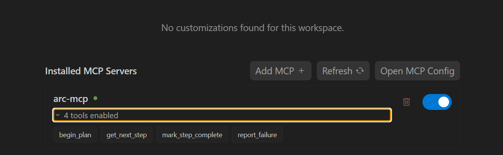

Adding a custom MCP (Model Context Protocol) server to Google Antigravity IDE doesn't currently happen via a one-click install, so you'll need to manually edit the IDE's raw configuration file.

Here is the step-by-step process to get your custom server connected:

1. **Open the MCP Store:**
In your Antigravity IDE, click the **"..." dropdown** at the top of the editor's side panel (the Agent panel), and select **MCP Servers** to open the built-in store.


2. **Access the Raw Configuration:**
At the top of the MCP store panel, click on **Manage MCP Servers**, then select **View raw config** (or **Open MCP Config**).

*Note: This opens your global configuration file. If you prefer to navigate via your file system, you can find it at `~/.gemini/config/mcp_config.json` (Mac/Linux) or `%userprofile%\.gemini\config\mcp_config.json` (Windows).*


3. **Add Your Server Configuration:**
Inside the `mcp_config.json` file, add your custom server details to the `mcpServers` object.

If you are running a **local executable (stdio transport)**:

```json
{
  "mcpServers": {
    "my-local-server": {
      "command": "path/to/executable",
      "args": ["--arg1", "value1"],
      "env": {
        "API_KEY": "your-api-key"
      }
    }
  }
}

```

If you are connecting to a **remote HTTP server**:

```json
{
  "mcpServers": {
    "my-remote-server": {
      "serverUrl": "https://api.example.com/mcp/",
      "headers": {
        "Authorization": "Bearer your-token"
      }
    }
  }
}

```

**Crucial Detail:** For remote servers, Antigravity strictly requires the key **`serverUrl`** (unlike Cursor or VS Code which might use `url` or `httpUrl`).


4. **Save and Refresh:**
Save the `mcp_config.json` file. Head back to the **Manage MCP Servers** page in the editor and click **Refresh** to confirm that your custom server now appears in your active list.

5. **Verify**
